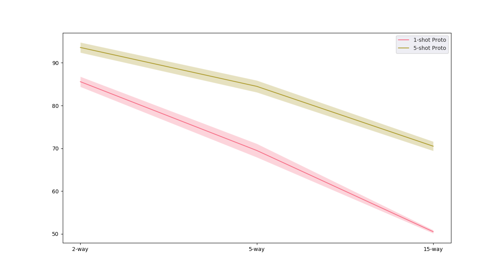

# Few-shot Learning Experiments on Fashion Dataset

Dependencies:
1. Pytorch : 1.0.1post2
2. Python :  3.6.9
3. Torchvision : 0.2.2
4. Check requirements.txt

## Training scripts:

| Model Name | Scripts | 
| --- | --- |
| ProtoNets  | ./run_loop_variants_proto.sh | 
| Matching Nets| ./run_loop_variants_match.sh|
| MAML (Order 1 ) |./run_loop_variants_maml.sh|   
| MAML (Order 2) | run_loop_variants_maml_2.sh | 

## Results

<h3>
 1 -shot 
 </h3>

| Method| 2-way | 5-way | 15-way |
| --- | --- | --- | --- | 
| Proto Nets | 85.6  | 69.5| 50.5|
| Matching Nets | 83.3 | 66.6| 51.8 |
| MAML | 87.5| 71.6 | 47.3|

<h3>
 5 -shot 
 </h3>

| Method| 2-way | 5-way | 15-way |
| --- | --- | --- | --- | 
| Proto Nets |93.6|84.5| 70.5| 
| Matching Nets |  81.0| 80.6 | 70.78|
| MAML |  94.8 | 83.1 | 71.8 | 

<h3> 
 1 shot vs 5 shot 
 </h3>

